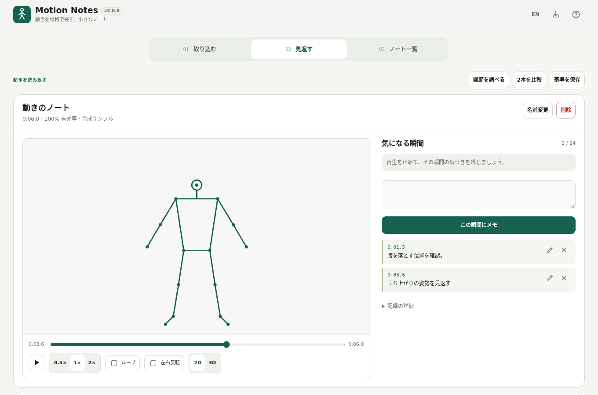

# Motion Notes / 動きのノート

動画やカメラから身体の動きを骨格で記録し、気になる瞬間にメモを付けて見返す、小さなノートです。旧 Pose Studio を再設計しました。

## できること

- 手元の動画、またはカメラから1人の動きを記録（最大5分）。
- 骨格だけで再生・スロー・左右反転・3D表示。
- 時間付きメモの追加・編集・再生位置へのジャンプ。1記録に24件まで。
- 再生できるHTML、ポーズ一覧PNG、バックアップJSON、座標CSVを保存。
- 関節の角度・軌跡・推定速度、2本の比較、基準となる動きの保存。

## 使い方

1. `pose-studio.html` を開き、「動画を読み込む」または「カメラを開始」を選びます。サンプルでも試せます。
2. 「見返す」で動きを再生し、気になる位置で「この瞬間にメモ」。鉛筆で編集、メモを押すとその瞬間へ移動できます。
3. 「ノートを持ち出す」で名前を付けて保存します。相手がそのまま再生するならHTML、姿勢を一覧で見せるならPNGを選びます。

旧 Pose Studio の `.pose.json` / `.pose-template.json` も右上の読込ボタンから開けます。リポジトリと配布ファイル名は互換性のため継続しています。

## プライバシー

処理は端末内。動画や入力をアップロードしません。元映像・音声は記録に含めず、骨格とメモをブラウザに保存します。**骨格データは匿名化データではありません。** 共有前に内容を確認してください。

ブラウザのデータ削除・容量制限で記録を失うことがあります。大切な記録はJSONでも保存してください。同じ配信元なら旧版のブラウザ保存データを引き継ぎます。別のURLやブラウザへ移動する場合はJSONを利用してください。

## 対応・制限

Chromium系を主な対象とします。カメラはHTTPSや利用許可が必要な場合があります。動画コーデックの対応はブラウザ次第です。動画は順番に解析するため、端末によって処理時間が長くなります。推定にはWebAssembly SIMDとWebGLが必要です。

関節・3D座標・比較値は推定です。フォームの正誤、医療、精密計測には利用できません。遮蔽や暗さ、撮影方向によって結果が変わり、認識できない区間は空白になります。複数人・元動画の保存・自動コーチングは対象外です。

## 単一HTML・オフライン

`pose-studio.html` と `dist/index.html` は同じファイルです。モデルを内包しているので、ダウンロード後は外部読込なしで使えます。`dist/index.self-extract.html` は自己展開版で、DecompressionStream対応が必要です。書き出した閲覧用HTMLにはモデルを含めません。

## 開発

Windowsでは `build-standalone.bat`。検査は `powershell.exe -NoProfile -ExecutionPolicy Bypass -File scripts/check-repository.ps1`。`src/index.template.html` を編集して再ビルドします。生成HTMLを手修正しないでください。

テンプレート更新の詳細は [移行記録](docs/TEMPLATE_MIGRATION.md)、実施した確認は [検証結果](docs/VERIFICATION.md)。モデル・依存は固定し、ビルド時に整合性を検証します。

## ライセンス

MIT。MediaPipe等は [THIRD_PARTY_NOTICES.md](THIRD_PARTY_NOTICES.md) を参照してください。
