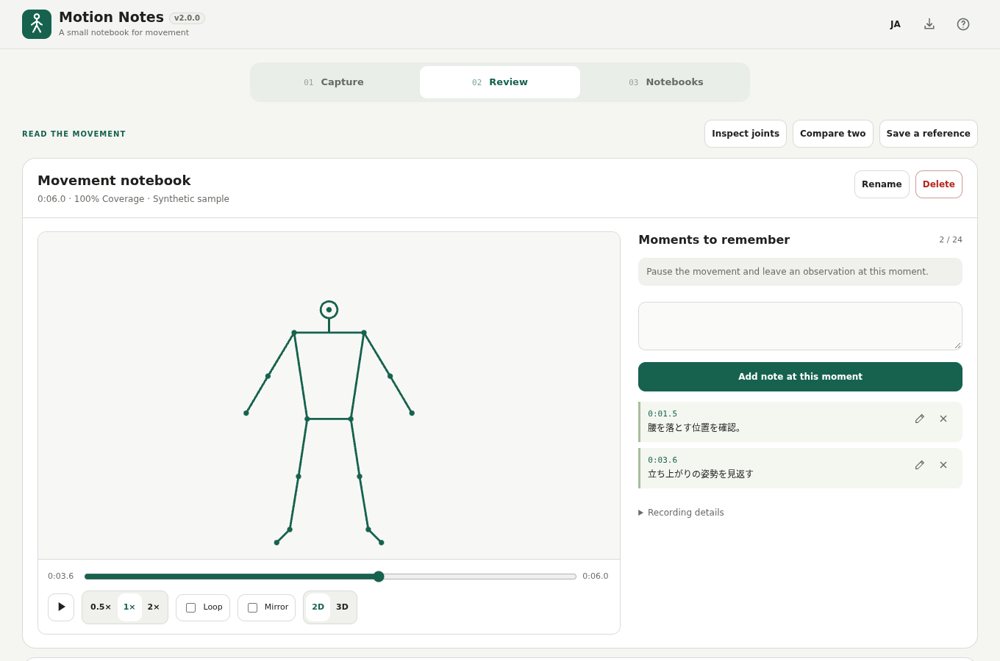

# Motion Notes

A small movement notebook: capture a skeleton from video or camera, mark important moments and revisit them without source footage. Redesigned from Pose Studio.

[日本語](README.ja.md)

## Features

- One-person camera or local-video pose capture, up to five minutes.
- Skeleton playback, slow motion, mirror and world-coordinate 3D view.
- Up to 24 timestamped notes per recording: add, edit, jump, delete and undo.
- Portable HTML player, PNG pose sheet, JSON backup and landmark CSV.
- Optional joint analysis, two-recording comparison and saved pose/motion references.

## How to use

1. Open `pose-studio.html` and choose a local video or start the camera. A synthetic sample is available first.
2. Open Review, seek to a moment and add an observation. Use the pencil to edit, or select the note to revisit it.
3. Edit the output filename and save: HTML for playback, PNG for a pose sheet, JSON for a restorable backup, CSV for coordinates.

The top-right import button accepts legacy Pose Studio `.pose.json` and `.pose-template.json`. Repository and distribution filenames remain unchanged for continuity.

## Privacy

Processing stays on your device. Source footage and audio are not stored or uploaded. Landmarks and notes are saved in this browser. **Pose data is not guaranteed anonymous**; review before sharing. Browser clearing or storage limits can lose data, so export important notebooks as JSON. Old browser data is retained on the same origin; use JSON when changing URL or browser.

## Browsers and limitations

Chromium is the primary target. Camera access may need HTTPS and permission. Video codec support depends on your browser. Import processes frames sequentially and can take time on slower devices. Inference requires WebAssembly SIMD and WebGL.

Angles, 3D coordinates and comparison values are estimates, not coaching judgments, medical advice or precision measurements. Occlusion, lighting and viewpoint affect results. Missing detections remain gaps. Multi-person tracking, source-video export and automatic coaching are outside scope.

## Single HTML / offline

`pose-studio.html` is identical to `dist/index.html`. Runtime, model and WASM are embedded: no external runtime downloads. `dist/index.self-extract.html` is an optional compressed wrapper requiring DecompressionStream. Exported viewer HTML does not contain an inference model or camera access.

## Development

On Windows, run `build-standalone.bat`. Run `powershell.exe -NoProfile -ExecutionPolicy Bypass -File scripts/check-repository.ps1` for checks. Edit `src/index.template.html` and rebuild; never hand-edit generated HTML.

See [template migration](docs/TEMPLATE_MIGRATION.md) and [verification](docs/VERIFICATION.md). Dependencies are pinned and integrity-checked. Tests are in `tests/`.

## License

MIT; see [THIRD_PARTY_NOTICES.md](THIRD_PARTY_NOTICES.md) for MediaPipe and model notices.
